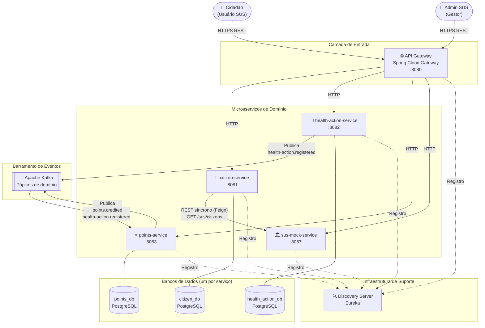

# Diagrama de Visão Geral — Arquitetura C4 (Container)

## Legenda

| Componente | Tecnologia | Porta |
|---|---|---|
| API Gateway | Spring Cloud Gateway | 8080 |
| Discovery Server | Netflix Eureka | 8761 |
| citizen-service | Spring Boot | 8081 |
| health-action-service | Spring Boot | 8082 |
| points-service | Spring Boot | 8083 |
| sus-mock-service | Spring Boot | 8087 |
| Apache Kafka | Kafka | 9092 |
| PostgreSQL (x3) | PostgreSQL 16 | 5432–5434 |

## Princípios

- **Comunicação síncrona (HTTP):** queries/commands do cliente externo via API Gateway, e a sincronização `citizen-service → sus-mock-service` (Feign), que simula a integração com um sistema externo (não é coordenação entre serviços de domínio)
- **Comunicação assíncrona (Kafka):** toda propagação de eventos de domínio entre serviços
- **Nenhum serviço de domínio chama outro diretamente** — toda coordenação entre eles ocorre via eventos
