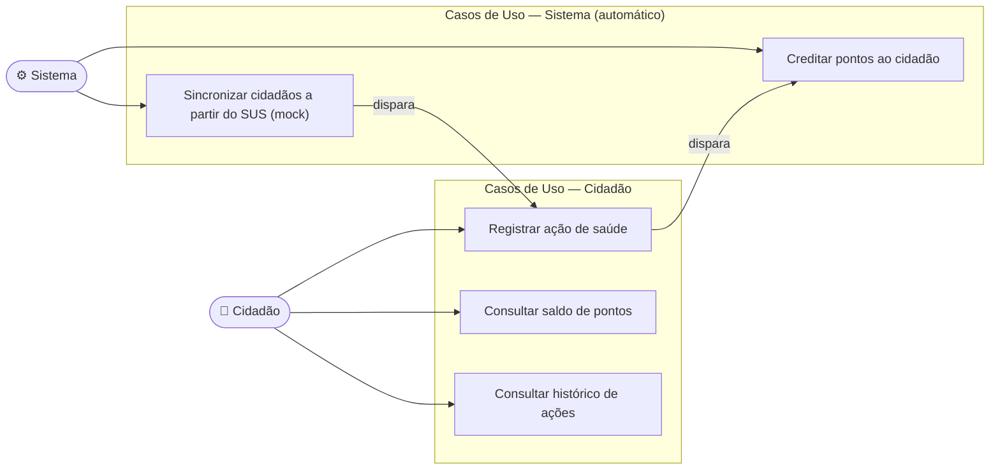

# Diagrama de Casos de Uso

---

## Descrição dos Casos de Uso

### UC1 — Sincronizar Cidadãos a partir do SUS (mock)
**Ator:** Sistema (`citizen-service`)
**Pré-condição:** `sus-mock-service` disponível
**Fluxo principal:**
1. `citizen-service` chama `GET /sus/citizens` no `sus-mock-service` (via Feign)
2. Para cada cidadão retornado, verifica se o CPF já existe na base local
3. Cidadãos novos são persistidos com status `ACTIVE`; cidadãos já existentes são ignorados
4. Sistema retorna a contagem de sincronizados/ignorados

Não há cadastro direto pelo cidadão — a plataforma não substitui o CADSUS, apenas consome dele.

---

### UC2 — Registrar Ação de Saúde
**Ator:** Cidadão
**Pré-condição:** Cidadão sincronizado e com `citizenId` válido
**Fluxo principal:**
1. Cidadão informa tipo de ação (`VACCINATION` ou `PREVENTIVE_EXAM`) e descrição
2. Sistema registra a ação, calcula os pontos e publica evento `health-action.registered`
3. Sistema retorna confirmação ao cidadão com os pontos a receber

**Fluxo alternativo:** Tipo de ação inválido → erro 400

---

### UC3 — Consultar Saldo de Pontos
**Ator:** Cidadão
**Fluxo:** Cidadão informa `citizenId` → sistema retorna saldo atual, total ganho e total resgatado

---

### UC4 — Consultar Histórico de Ações
**Ator:** Cidadão
**Fluxo:** Cidadão informa `citizenId` → sistema retorna todas as ações de saúde registradas

---

### UC11 — Creditar Pontos (automático)
**Ator:** Sistema (`points-service`)
**Trigger:** Evento `health-action.registered`
**Fluxo:** Credita pontos na conta, persiste transação com chave de idempotência (`eventId`)

---

## Roadmap (próximas fases)

| Caso de Uso | Depende de |
|---|---|
| Navegar no catálogo de recompensas | `reward-service` |
| Solicitar resgate de recompensa | `reward-service` + `redemption-service` |
| Consultar status do resgate | `redemption-service` |
| Notificar cidadão | `notification-service` |
| Validar ação de saúde manualmente | Painel admin |
| Relatório de adesão para gestores | Painel admin |
