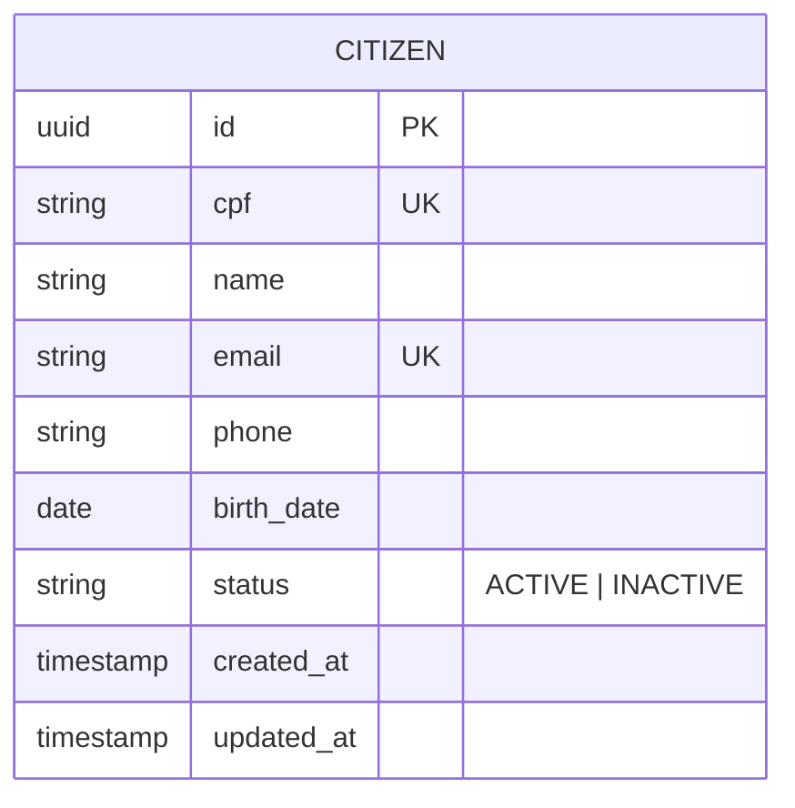
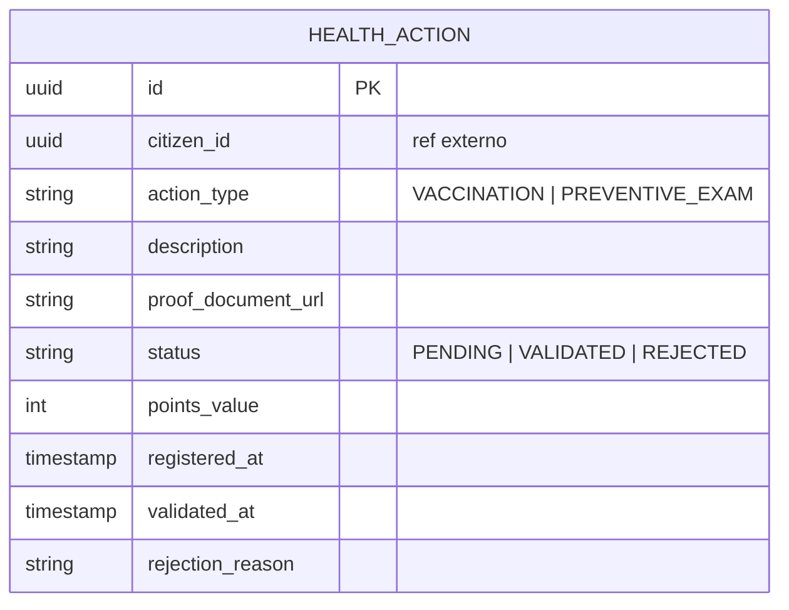
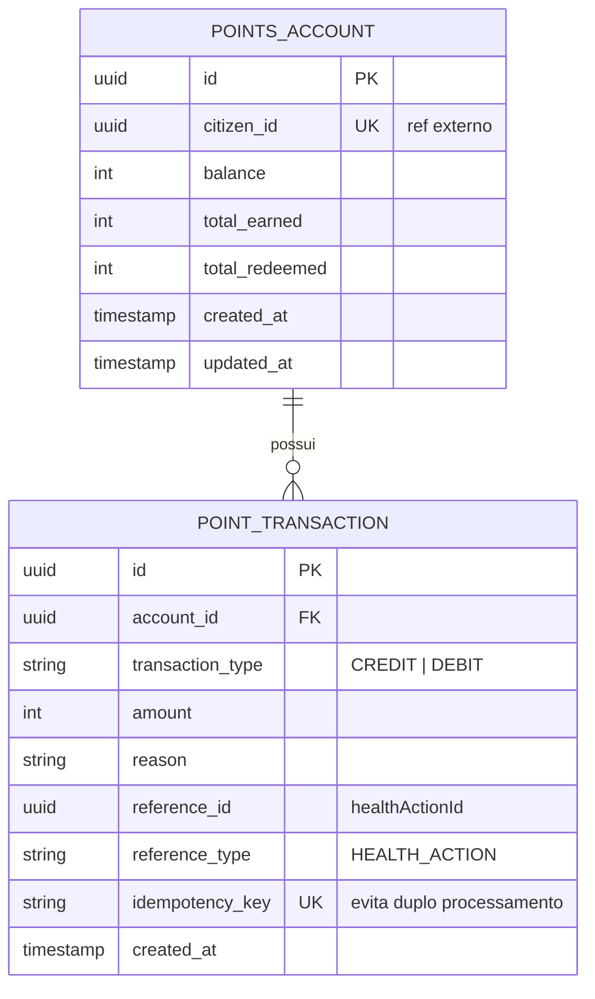
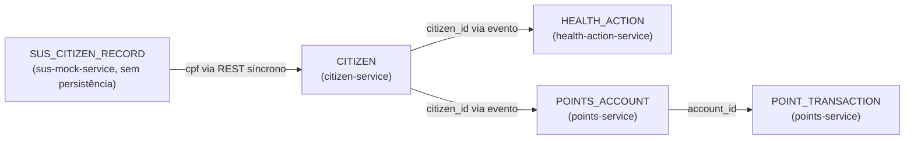

# Diagrama de Entidades (Domain Model por Bounded Context)

> Cada bounded context representa o banco de dados de um microsserviço.  
> **Não há joins entre contextos** — cada serviço é dono exclusivo dos seus dados.

---

## Contexto: citizen-service

> Registros são criados via sincronização com `sus-mock-service` (simulação do CADSUS) — não há cadastro direto pelo cidadão. Ver `doc/diagramas/02-casos-de-uso.md` UC1.

---

## Contexto: health-action-service

**Pontos por tipo:**
| action_type | points_value |
|---|---|
| VACCINATION | 100 |
| PREVENTIVE_EXAM | 150 |

---

## Contexto: points-service

---

## Visão consolidada dos IDs externos

Os serviços se comunicam via **eventos Kafka**, carregando apenas IDs de referência — nunca fazendo JOIN entre bases de dados.

---

## Roadmap — Contextos das próximas fases

| Bounded Context | Serviço | Fase |
|---|---|---|
| Catálogo de recompensas (REWARD) | `reward-service` | Fase 1 |
| Resgates (REDEMPTION) | `redemption-service` | Fase 1 |
