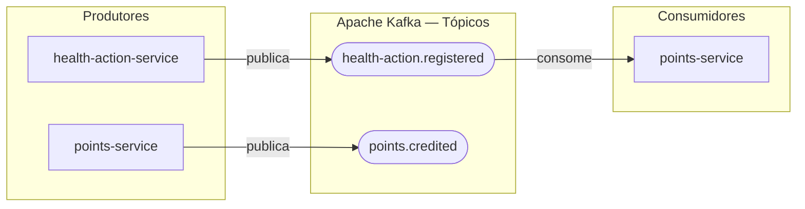
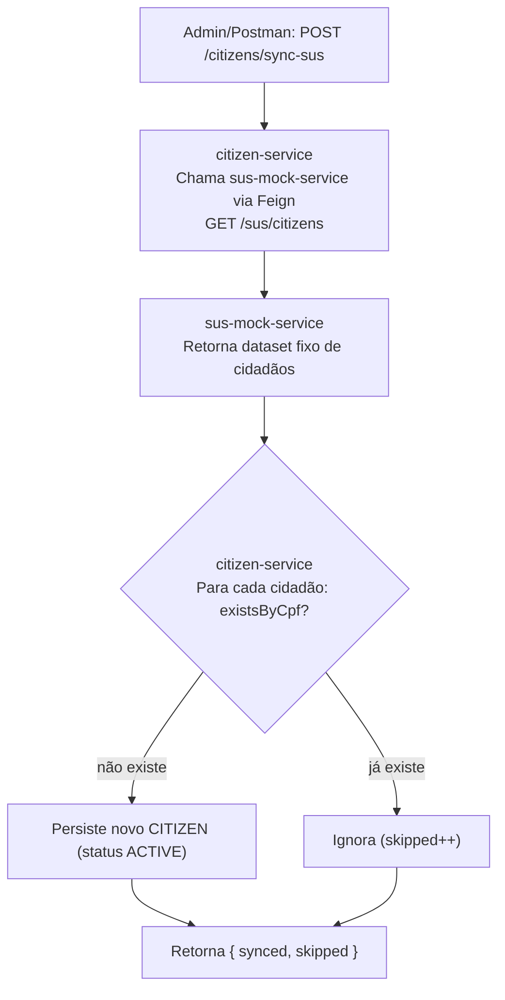
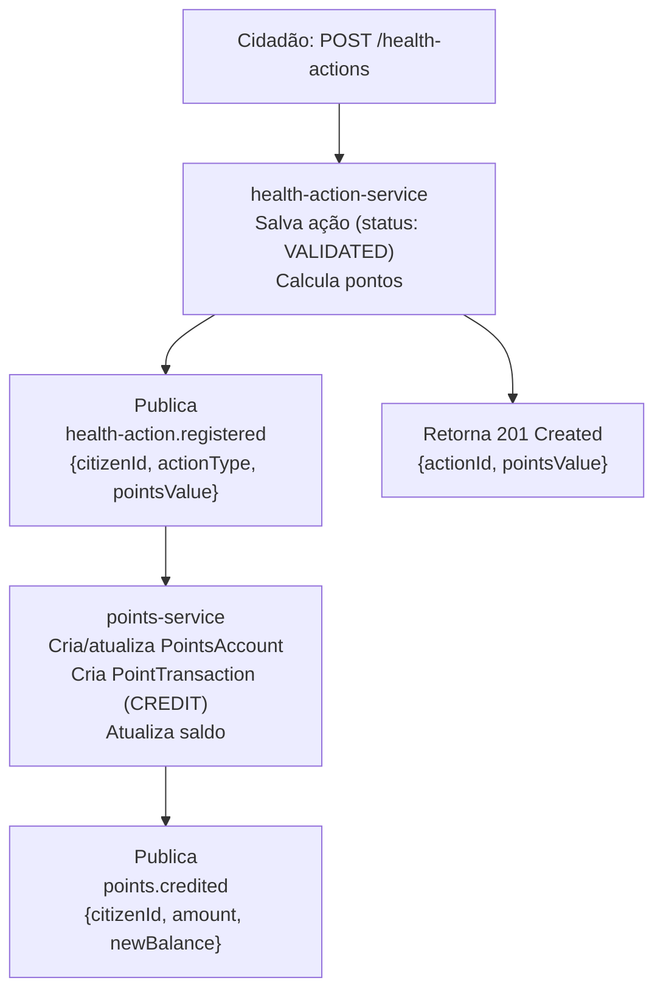

# Diagrama de Fluxo de Eventos (Event-Driven Architecture)

## Visão Geral do Barramento de Eventos

---

## Fluxo 0: Sincronização de Cidadãos com o SUS (mock)

> Comunicação síncrona (REST/Feign), não Kafka — `sus-mock-service` simula um sistema externo (CADSUS).

---

## Fluxo 1: Registro de Ação de Saúde

---

## Catálogo de Eventos (MVP)

| Tópico Kafka | Publicado por | Consumido por | Payload |
|---|---|---|---|
| `health-action.registered` | health-action-service | points-service | `{eventId, citizenId, actionId, actionType, pointsValue, registeredAt}` |
| `points.credited` | points-service | *(notification-service — roadmap)* | `{eventId, citizenId, amount, newBalance, createdAt}` |

> **`eventId`** é usado como chave de idempotência pelo `points-service` para evitar duplo crédito em caso de reentrega pelo Kafka.

---

## Roadmap — Eventos das próximas fases

| Tópico | Fase |
|---|---|
| `redemption.requested` / `points.debited` / `redemption.approved` / `reward.granted` | Fase 1 — `redemption-service` + `reward-service` |
| `points.credited` → `notification-service` | Fase 1 — `notification-service` |
