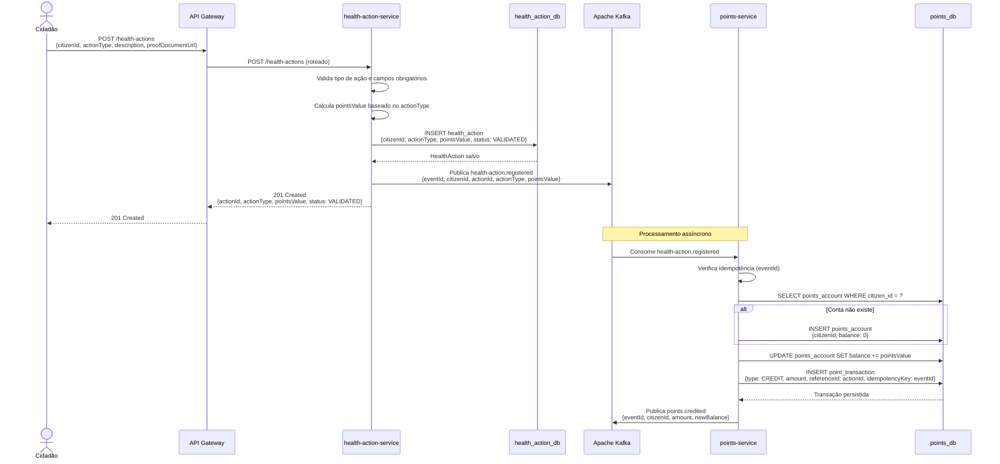
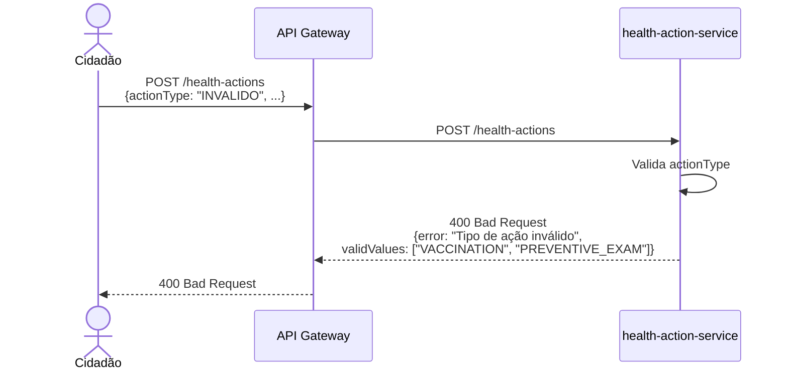

# Diagrama de Sequência — Registro de Ação de Saúde

---

## Cenário Alternativo: Tipo de Ação Inválido

---

## Notas de Implementação

- O `eventId` é um UUID gerado pelo `health-action-service` e embarcado no evento Kafka
- O `points-service` armazena o `eventId` como `idempotency_key` na tabela `point_transaction` com constraint `UNIQUE` — garantindo que reentregas do Kafka não causem duplo crédito
- A resposta ao cidadão é **síncrona** (201 Created) e não aguarda o processamento assíncrono de pontos
- Notificação ao cidadão via `notification-service` é roadmap (Fase 1)
