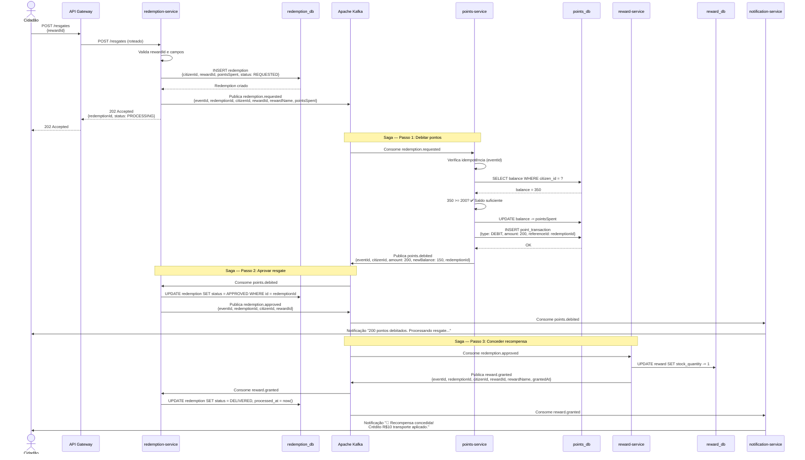
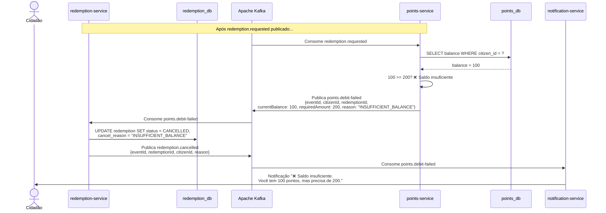
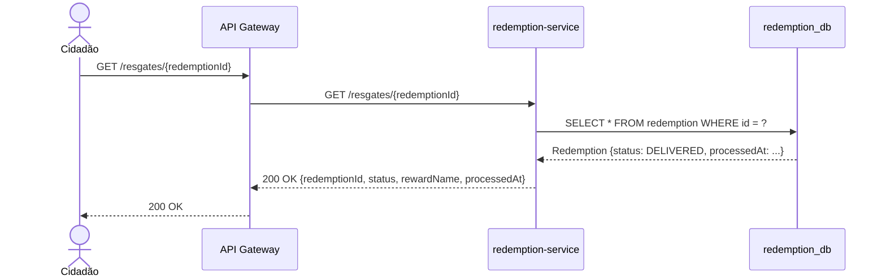

# Diagrama de Sequência — Resgate de Recompensa (Saga por Coreografia)

## Fluxo Feliz (Happy Path)

---

## Fluxo Alternativo: Saldo Insuficiente (Compensação da Saga)

---

## Consulta de Status (Síncrona)

