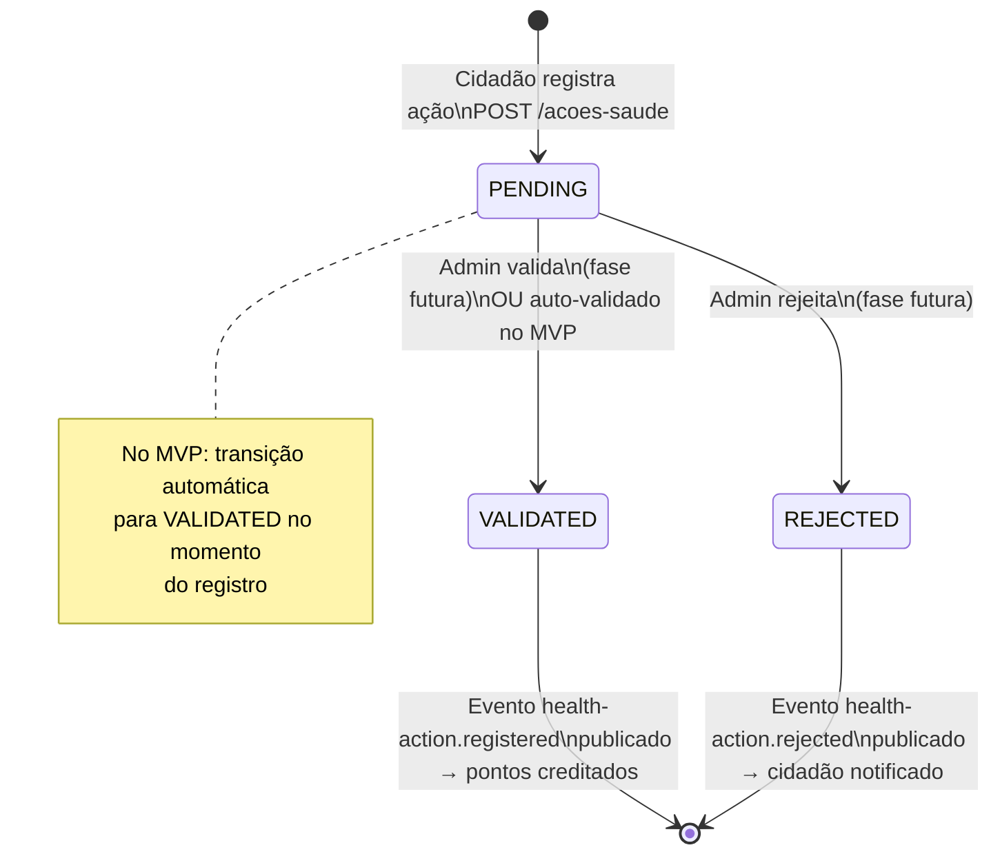
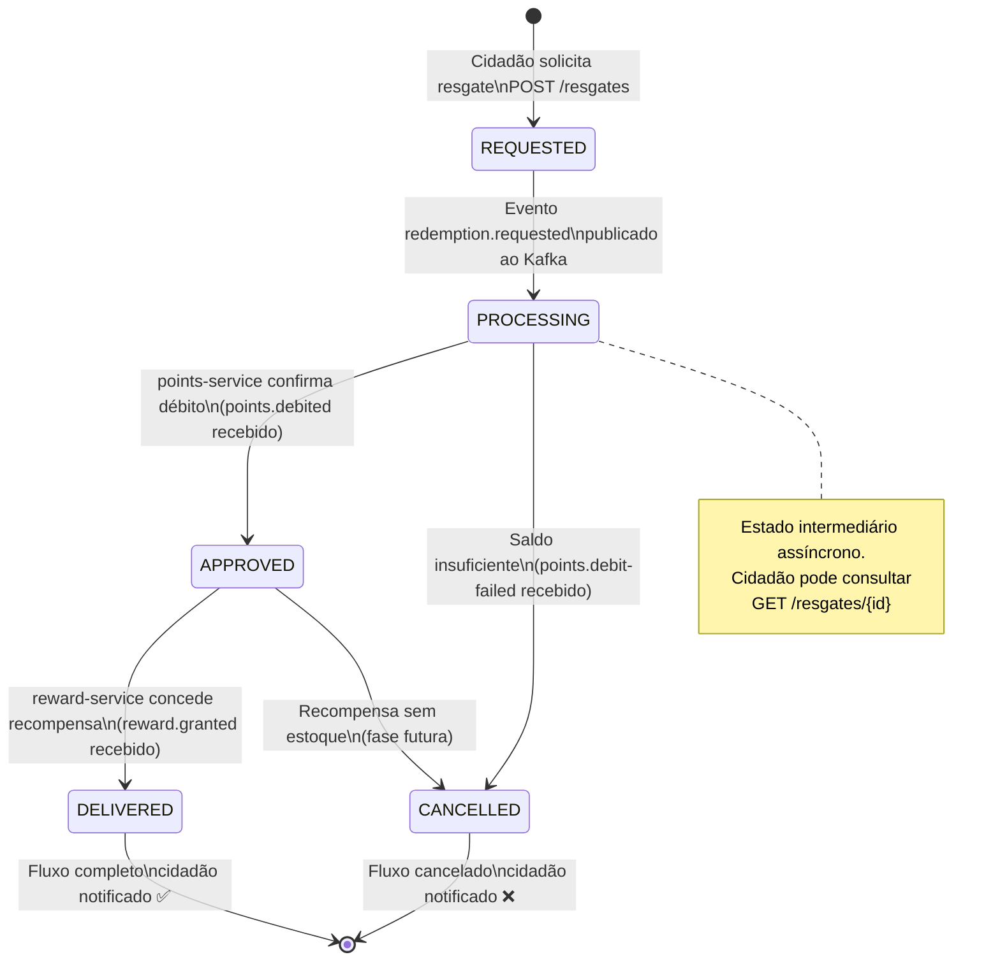
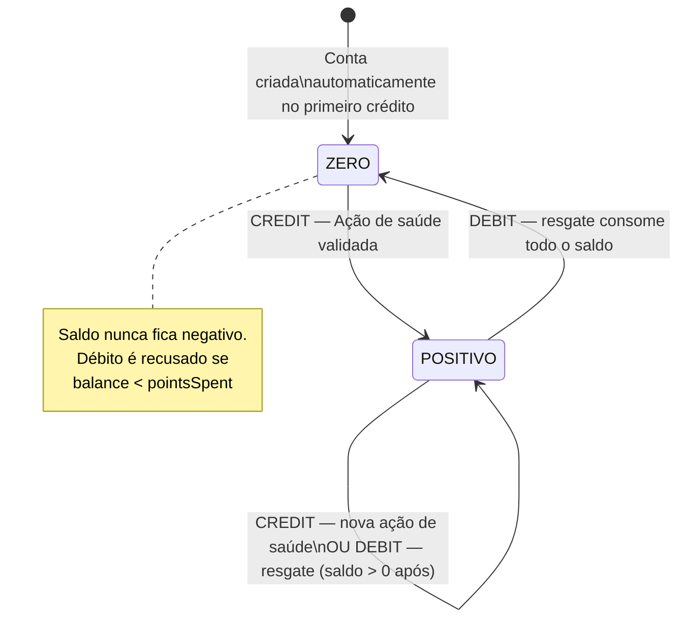

# Diagrama de Máquina de Estados

## HealthAction — Status da Ação de Saúde

---

## Redemption — Status do Resgate

---

## PointsAccount — Transições de Saldo

---

## Resumo das Transições por Evento

| Entidade | Estado Atual | Evento/Trigger | Próximo Estado |
|---|---|---|---|
| HealthAction | — | POST /acoes-saude | VALIDATED (MVP) |
| Redemption | — | POST /resgates | REQUESTED |
| Redemption | REQUESTED | redemption.requested publicado | PROCESSING |
| Redemption | PROCESSING | points.debited recebido | APPROVED |
| Redemption | PROCESSING | points.debit-failed recebido | CANCELLED |
| Redemption | APPROVED | reward.granted recebido | DELIVERED |
