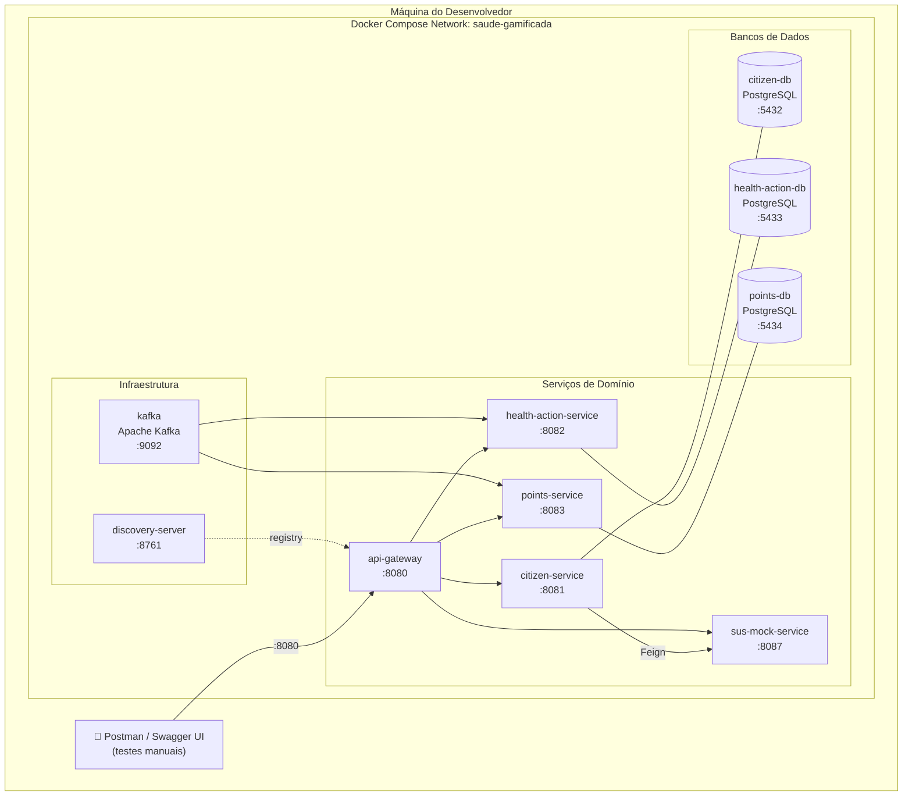

# Diagrama de Implantação — Ambiente Local (Docker Compose)



---

## Ordem de Inicialização

```
1. kafka           (broker sem Zookeeper — modo KRaft)
2. *-db (x3)       (independentes, sobem em paralelo)
3. discovery-server
4. citizen-service, health-action-service, points-service, sus-mock-service
   (dependem de: discovery-server, kafka [exceto sus-mock-service], seus respectivos DBs)
5. api-gateway     (depende de: discovery-server + todos os serviços registrados)
```

---

## Comandos de Desenvolvimento Local

```bash
# Subir toda a stack
docker compose up -d

# Verificar saúde dos serviços
docker compose ps

# Acompanhar logs de um serviço específico
docker compose logs -f health-action-service

# Acessar Eureka Dashboard
open http://localhost:8761

# Parar tudo
docker compose down

# Parar e remover volumes (limpa bancos)
docker compose down -v
```

---

## Swagger UI por Serviço

| Serviço | URL direta |
|---|---|
| citizen-service | http://localhost:8081/swagger-ui.html |
| health-action-service | http://localhost:8082/swagger-ui.html |
| points-service | http://localhost:8083/swagger-ui.html |
| sus-mock-service | http://localhost:8087/swagger-ui.html |
