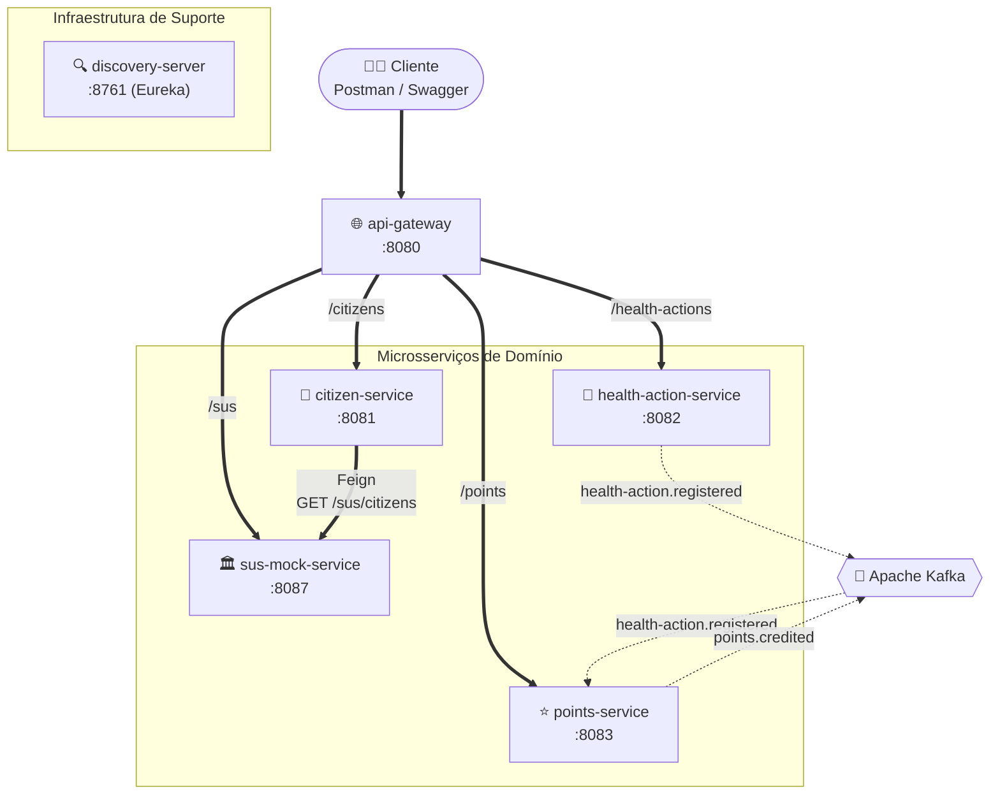

# Diagrama de Comunicação entre Microsserviços

Visão focada em **como os microsserviços se comunicam entre si**: chamadas síncronas (REST, via API Gateway) em linha cheia e eventos assíncronos (Kafka) em linha tracejada.

---

## Matriz de Comunicação

| Serviço | Recebe (síncrono) | Chama (síncrono) | Publica (Kafka) | Consome (Kafka) |
|---|---|---|---|---|
| **api-gateway** | Cliente (REST) | — | — | — |
| **citizen-service** | api-gateway (`/citizens`) | sus-mock-service (Feign) | — | — |
| **health-action-service** | api-gateway (`/health-actions`) | — | `health-action.registered` | — |
| **points-service** | api-gateway (`/points`) | — | `points.credited` | `health-action.registered` |
| **sus-mock-service** | api-gateway (`/sus`), citizen-service (Feign) | — | — | — |

**Regra de ouro:** nenhum microsserviço de domínio chama outro diretamente via REST, com uma exceção deliberada: `citizen-service` chama `sus-mock-service` via Feign porque este último simula um sistema externo (CADSUS), não um serviço de domínio interno. Toda comunicação entre serviços de domínio acontece por eventos no Kafka.

Para o detalhamento de cada tópico (payload, produtor/consumidor) ver [04-fluxo-eventos.md](./04-fluxo-eventos.md).
