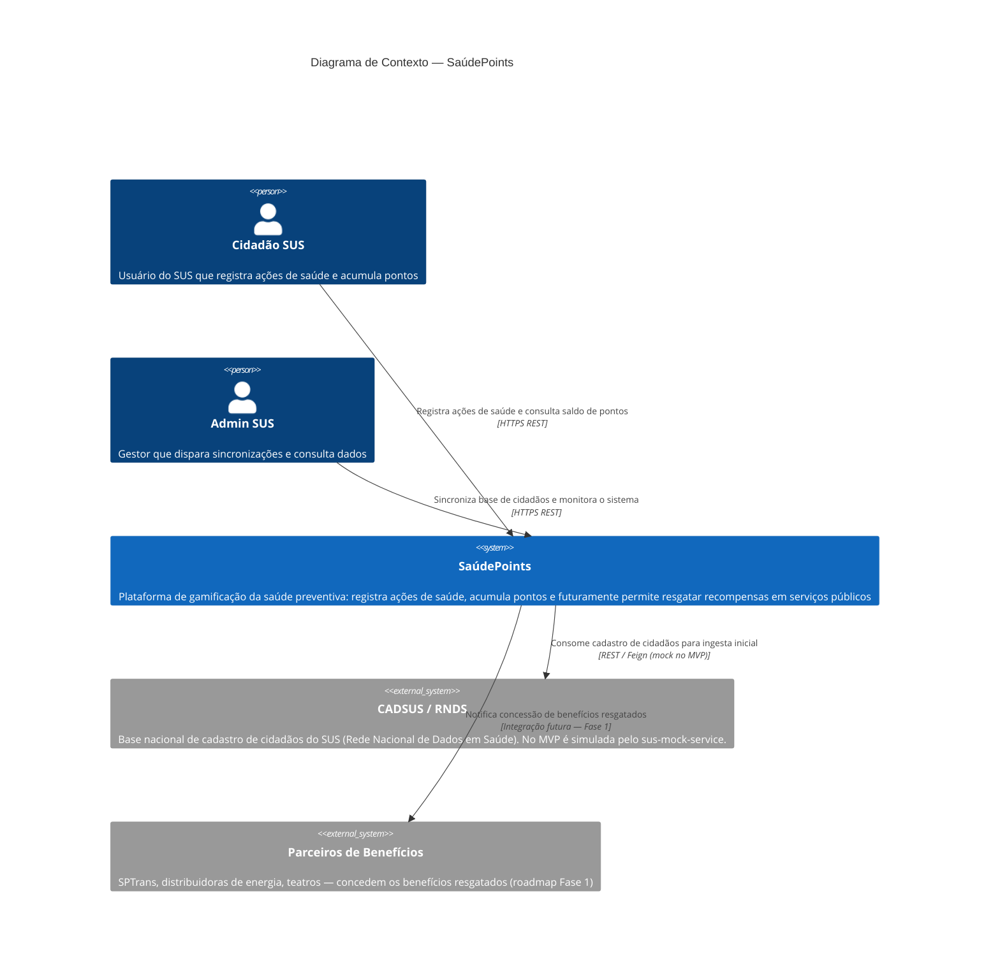
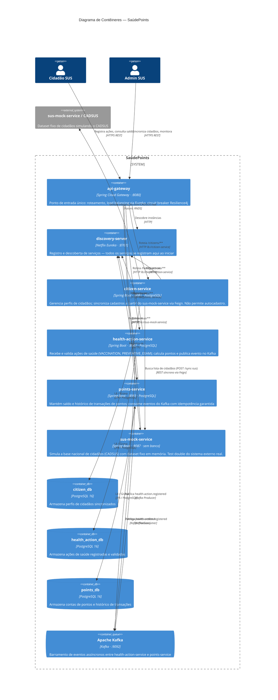
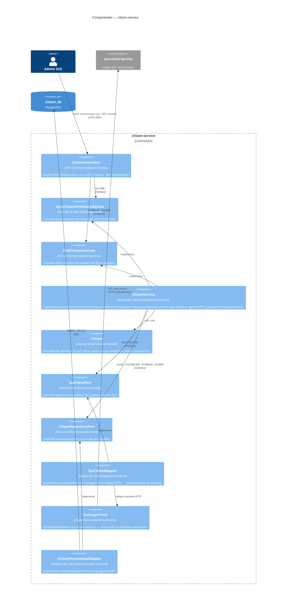
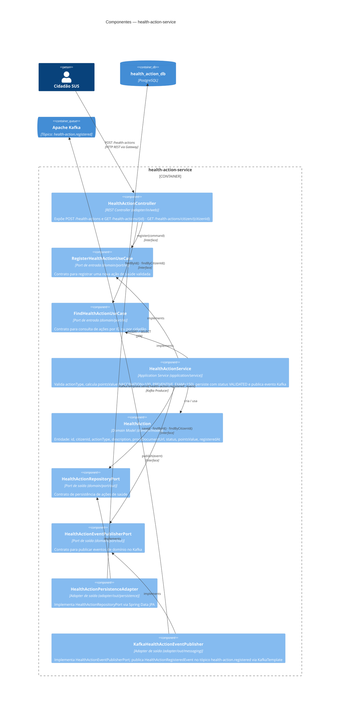
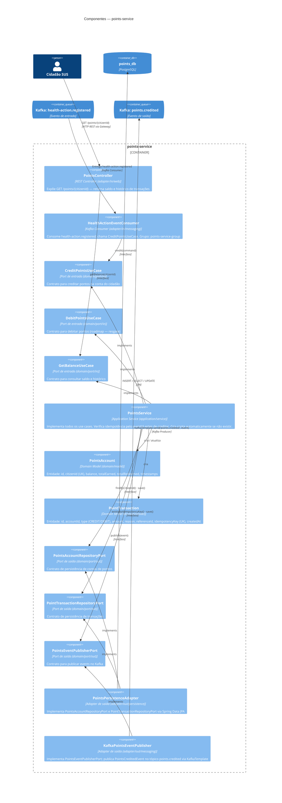

# C4 Model — SaúdePoints

> O C4 Model descreve a arquitetura de software em quatro níveis de zoom progressivo:
> **Context → Container → Component → Code**. O nível 4 (Code) é omitido — o código-fonte é a documentação autoritativa nesse nível.

---

## Nível 1 — System Context (Contexto do Sistema)

Mostra o sistema como uma caixa preta e suas relações com atores e sistemas externos.

---

## Nível 2 — Container (Contêineres)

Mostra os processos executáveis, bancos de dados e o barramento de mensagens que compõem o sistema.

---

## Nível 3 — Component: citizen-service

Mostra os componentes internos seguindo a Arquitetura Hexagonal (Ports & Adapters).

---

## Nível 3 — Component: health-action-service

---

## Nível 3 — Component: points-service

---

## Resumo das dependências entre níveis

| Nível | Diagrama | Arquivo |
|---|---|---|
| 1 — Context | Atores + sistemas externos | Este arquivo (`10-c4-model.md`) |
| 2 — Container | Serviços, DBs, Kafka | Este arquivo (`10-c4-model.md`) |
| 3 — Component (citizen) | Hexagonal: controller → service → adapters | Este arquivo (`10-c4-model.md`) |
| 3 — Component (health-action) | Hexagonal: controller → service → Kafka publisher | Este arquivo (`10-c4-model.md`) |
| 3 — Component (points) | Hexagonal: consumer + controller → service → adapters | Este arquivo (`10-c4-model.md`) |
| 4 — Code | Implementação Java | Código-fonte em `services/` |
